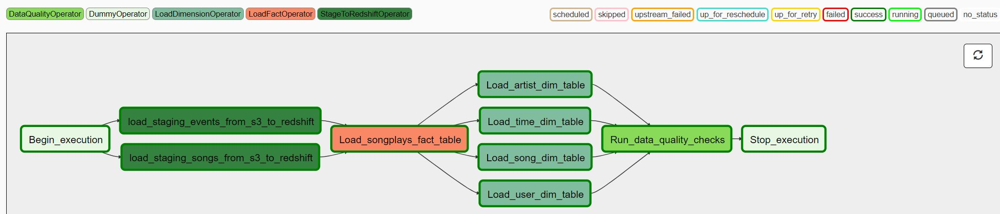
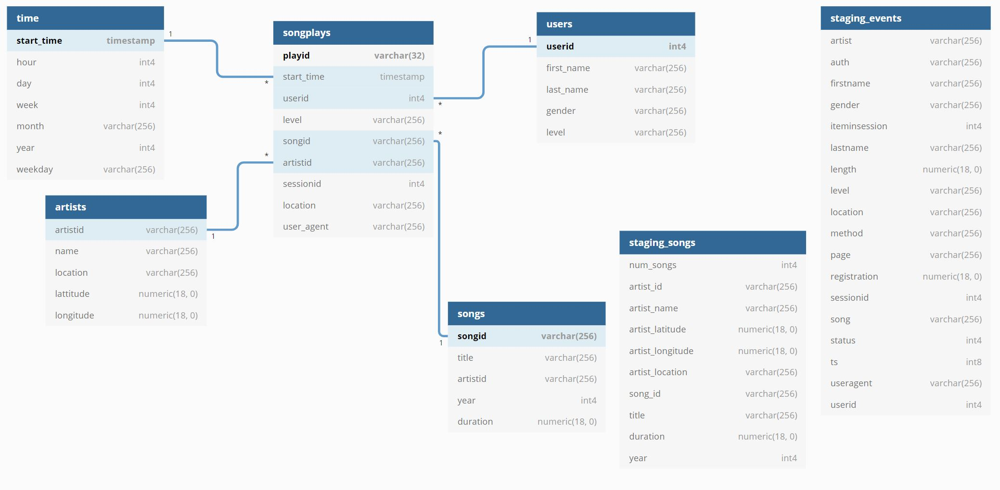

# 1. Project summary:
## 1.1 The Business problem:

The startup `Sparkify` which has their music app up and running on the cloud has decided that it is time to introduce more automation and monitoring to their data warehouse ETL pipelines and come to the conclusion that the best tool to achieve this is Apache Airflow to build an incremental ETL pipeline.

Their data resides in S3 (Amazon Web Services), in a two directories:
* a directory of JSON logs of users activity
* a directory of JSON songs metadata

## 1.2 Project Inputs:

The folowing folders were given at the beginning of the project:

* Song data: s3://udacity-dend/song_data (with JSON songs data files)
* Log data: s3://udacity-dend/log_data (with JSON log data files)
* Log data json path: s3://udacity-dend/log_json_path.json (a JSON file providing the structure of JSON log data files)

## 1.3 The project output: the analytic model

Using **Airflow 1.10 and python 3.6** , our main objective is to produce an ETL pipeline workflow as it follows:

To achieve this, I proceeded in two steps:

#### Step 1: The creation of the Data Werehouse schema:

I created a DAG (Discrete Acyclic Diagram) (`sparkify_create_table_dag.py`) that:
* DROP all tables in the schema
* CREATE all table as new

This DAG is used ease the development process.

#### Step 2: The ETL pipeline automation:

I built an automated DAG (`automated_sparkify_dag.py`) with custom airflow operators to:

* Extract date from inputs (with `StageToRedshiftOperator` operator)
* Stage the data into a Redshift Data Warehouse (with `StageToRedshiftOperator` operator)
* Transform data through SQL designed SQL commands (`LoadFactOperator and LoadDimensionOperator` operators)
* Load data into the designed Redshift Data Warehouse (a set of dimension and fact tables) (with `LoadFactOperator and LoadDimensionOperator` operators)
* Perform some data quality checks (with `DataQualityOperator` operator)

#### File locations:

All, the operators are stored in the airflow *airflow/plugins/udac_plugins/* folder and the master DAG file in the *airflow/dag/udac_project* folder.

## 2. Data Warehouse schema:

As we were interested in having aggregated results easily, the **star schema** was recommended and implemented. 

The star schema is made up of the following tables:

* Dimension tables (with features columns within parenthesis):
    1. users (columns list: user_id, first_name, last_name, gender, level)
    2. songs (columns list: song_id, title, artist_id, year, duration)
    3. artists (columns list: artist_id, name, location, latitude, longitude)
    4. time (columns list: start_time, hour, day, week, month, year, weekday)

* Fact table: 
    1. songplays (columns list: songplay_id, start_time, user_id, level, song_id, artist_id, session_id, location, user_agent)

# 3. How the use the files:

1. Create both an IAM role and a cluster on Amazon redshift
2. Create your connection IDs (aws_credentials & redshift) in airflow connection
3. **Respectivelly copy *udac_project* folder in you airflow 'dags' folder and the *udac_plugins* folder in your *airflow/plugins* folder**
3. Run `sparkify_create_table_dag.py`to create the Data Warehouse schema
4. Next, run `automated_sparkify_dag.py`